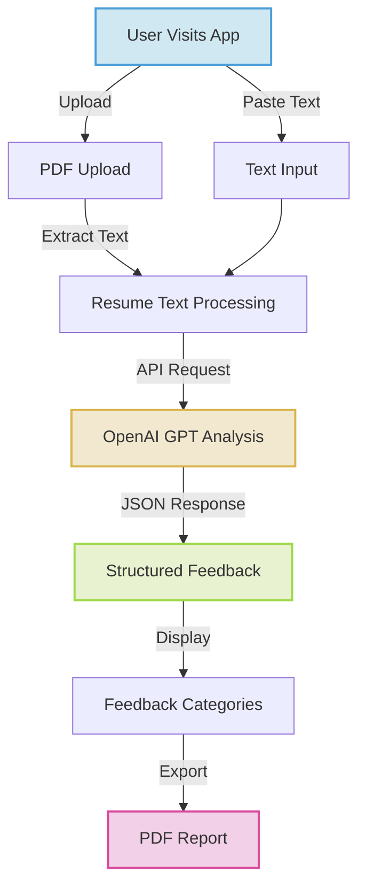

# Resume Feedback Generator ✨

<div align="center">


**[✅ Live Demo](https://resume-feedback-generator.vercel.app/) | [📚 Documentation](#how-it-works) | [🚀 Getting Started](#getting-started) | [📱 Features](#key-features) | [🛠️ Tech Stack](#technology-stack)**

</div>

## 📋 Overview

**Resume Feedback Generator** is a polished, modern web application that empowers job seekers to enhance their resumes with AI-powered feedback. Upload your resume or paste the text, and receive instant, structured feedback to improve your job application materials and boost your chances of landing interviews.

This fully client-side app provides actionable suggestions, section-by-section analysis, and a numerical score to help you understand your resume's strengths and weaknesses.


## ✨ Key Features

- **📤 Intuitive Upload Experience**
  - Drag & drop PDF upload with visual feedback
  - Text paste option for maximum flexibility
  - Clean, user-friendly interface

- **🤖 AI-Powered Analysis**
  - Comprehensive resume evaluation using OpenAI's GPT model
  - Structured feedback organized by resume sections
  - Overall score assessment (0-100) with visual indicators

- **📊 Detailed Feedback Categories**
  - **Overall Impression:** Quick summary of your resume's strengths and weaknesses
  - **Section-by-Section Analysis:** Targeted feedback for each resume component
  - **Actionable Suggestions:** Concrete recommendations for improvement

- **💾 Export & Sharing**
  - Export feedback to PDF for later reference
  - Clean, professionally formatted reports
  - Easy to share with mentors or career coaches

- **🎨 Modern User Experience**
  - Dark/Light mode toggle with system preference detection
  - Beautiful animations and transitions using Framer Motion
  - Fully responsive design for all devices

- **🔒 Privacy Focused**
  - Client-side processing (no server storage of your resume)
  - Local API key storage option
  - Mock feedback available for testing without an API key

## 🛠️ Technology Stack

<div align="center">

[](https://reactjs.org/)
[](https://www.typescriptlang.org/)
[](https://tailwindcss.com/)
[](https://www.framer.com/motion/)
[](https://openai.com/)
[](https://vitejs.dev/)

</div>

- **Frontend Framework**: React 19 with TypeScript
- **Styling**: Tailwind CSS for utility-first styling
- **Animations**: Framer Motion for smooth transitions and effects
- **PDF Processing**: 
  - **pdf.js** for PDF parsing and text extraction
  - **html2pdf.js** for exporting feedback to PDF
- **AI Integration**: OpenAI API (GPT model) for resume analysis
- **Build Tools**: Vite for fast development and optimized production builds

## 💻 Getting Started

### Prerequisites

- **Node.js**: v16.0.0 or newer
- **Package Manager**: npm, yarn, or pnpm

### 📦 Installation

<details>
<summary>Clone and Setup (click to expand)</summary>

```bash
# Clone the repository
git clone https://github.com/yourusername/resume-feedback-generator.git

# Navigate to the project directory
cd resume-feedback-generator

# Install dependencies
npm install
# or
yarn install
# or
pnpm install
```
</details>

### 🚀 Development

```bash
# Start the development server
npm run dev
# or 
yarn dev
# or
pnpm dev
```

Then open your browser and navigate to **[http://localhost:5173](http://localhost:5173)**

### 🧪 Testing Without API Key

You can test the application without an OpenAI API key using our built-in mock feedback feature:

1. Upload a resume or paste resume text
2. Leave the API key field empty
3. Click "Generate Feedback"
4. The system will provide sample feedback for testing purposes

## 📝 How It Works

### User Flow



### Resume Analysis

The app leverages OpenAI's advanced language models to analyze your resume and provide feedback in several key areas:

1. **Overall Assessment**: General impression and high-level recommendations
2. **Section Analysis**: Specific feedback for each section (experience, education, skills, etc.)
3. **Improvement Suggestions**: Actionable recommendations to enhance your resume
4. **Numerical Score**: A score out of 100 to help track improvements over time

### API Integration

The application uses the OpenAI API with a structured prompt to ensure consistent, high-quality feedback:

```typescript
// Simplified example from src/utils/openaiUtils.ts
const prompt = `You are a professional resume coach. Review the following resume and provide:
1. Overall impressions (3-5 sentences)
2. Section-by-section feedback with specific improvements for each section
3. 5 specific, actionable suggestions for improvement
4. A score out of 100

Format your response as valid JSON with the following structure:
{
  "overallImpression": "string with overall feedback",
  "sectionFeedback": {
    "section name": "feedback for this section",
    ...other sections
  },
  "suggestions": ["suggestion 1", "suggestion 2", ...],
  "score": number
}`;
```

## 🔧 Customization Options

You can customize various aspects of the application to fit your specific needs:

### AI Prompt Customization

Modify the AI prompt in `src/utils/openaiUtils.ts` to focus on specific aspects of resume analysis or change the tone/style of feedback:

```typescript
// Example modification to focus on ATS optimization
const prompt = `You are a professional resume coach specializing in ATS optimization. 
Review the following resume and provide:
1. Overall assessment of ATS compatibility (3-5 sentences)
2. Section-by-section feedback with specific keyword improvements
// ...rest of prompt
`;
```

### Visual Theme Customization

The application uses Tailwind CSS for styling. Customize the theme by editing `tailwind.config.js`:

```javascript
// Example: Changing the primary color scheme
theme: {
  extend: {
    colors: {
      blue: {
        50: '#e6f0ff',
        100: '#bbd6ff',
        // ...your custom color palette
        600: '#2563eb', // primary button color
        700: '#1d4ed8',
      }
    }
  }
}
```

### Feedback Display Customization

Modify the display of feedback in `src/components/FeedbackCard.tsx` to change the layout, add new sections, or adjust the visualization of the score.

## 📦 Deployment

Deploy your customized Resume Feedback Generator to your platform of choice:

<details>
<summary><b>Vercel Deployment</b> (recommended)</summary>

1. Push your code to GitHub
2. Import your repository in [Vercel](https://vercel.com)
3. Configure build settings:
   - Build Command: `npm run build` or `yarn build`
   - Output Directory: `dist`
4. Deploy!

</details>

<details>
<summary><b>Netlify Deployment</b></summary>

1. Push your code to GitHub
2. Import your repository in [Netlify](https://netlify.com)
3. Configure build settings:
   - Build Command: `npm run build` or `yarn build`
   - Publish Directory: `dist`
4. Deploy!

</details>

<details>
<summary><b>Manual Build</b></summary>

```bash
# Build for production
npm run build
# or
yarn build
# or
pnpm build

# The build artifacts will be in the 'dist' directory
```

You can then host the contents of the `dist` directory on any static hosting service.

</details>

## 📱 Mobile Experience

The Resume Feedback Generator is fully responsive and optimized for mobile devices:

<div align="center">
  
  
</div>

- Optimized upload interface for touch devices
- Readable feedback display on smaller screens
- Smooth performance on mobile browsers
- Responsive controls and buttons

## 👨‍💻 Contributing

Contributions are welcome! Here's how you can help improve the Resume Feedback Generator:

1. **Report Issues**: Found a bug or have a feature request? [Open an issue](https://github.com/yourusername/resume-feedback-generator/issues).

2. **Submit PRs**: Feel free to fork the project and submit pull requests.

3. **Feature Development**: Want to add a new feature?
   - Fork the repository
   - Create your feature branch (`git checkout -b feature/amazing-feature`)
   - Commit your changes (`git commit -m 'Add some amazing feature'`)
   - Push to the branch (`git push origin feature/amazing-feature`)
   - Open a Pull Request

4. **Spread the Word**: Star the repository and share it with your network!

### Development Guidelines

- Follow the existing code style
- Write tests for new features
- Update documentation as needed
- Be kind and respectful to other contributors

## 💖 Support the Project

If you find this project helpful, consider:

- Giving it a ⭐ on GitHub
- Sharing it with friends and colleagues
- [Buying me a coffee](https://www.buymeacoffee.com/yourusername)

## 📄 License

This project is licensed under the MIT License - see the LICENSE file for details.

## 🙏 Acknowledgements

- [OpenAI](https://openai.com/) for providing the AI API
- [React](https://reactjs.org/) and [Vite](https://vitejs.dev/) for the development framework
- [Tailwind CSS](https://tailwindcss.com/) for the styling system
- [Framer Motion](https://www.framer.com/motion/) for animations
- [PDF.js](https://mozilla.github.io/pdf.js/) and [html2pdf.js](https://github.com/eKoopmans/html2pdf.js) for PDF operations

## 📬 Contact

Have questions or feedback? Reach out through:

- GitHub Issues: [Open an issue](https://github.com/yourusername/resume-feedback-generator/issues)
- Email: your.email@example.com
- Twitter: [@YourTwitterHandle](https://twitter.com/YourTwitterHandle)

---

<div align="center">

Made with ❤️ by [Tejas jadhav](https://github.com/tejas-jadhav-cse)

</div>
  },
})
```
